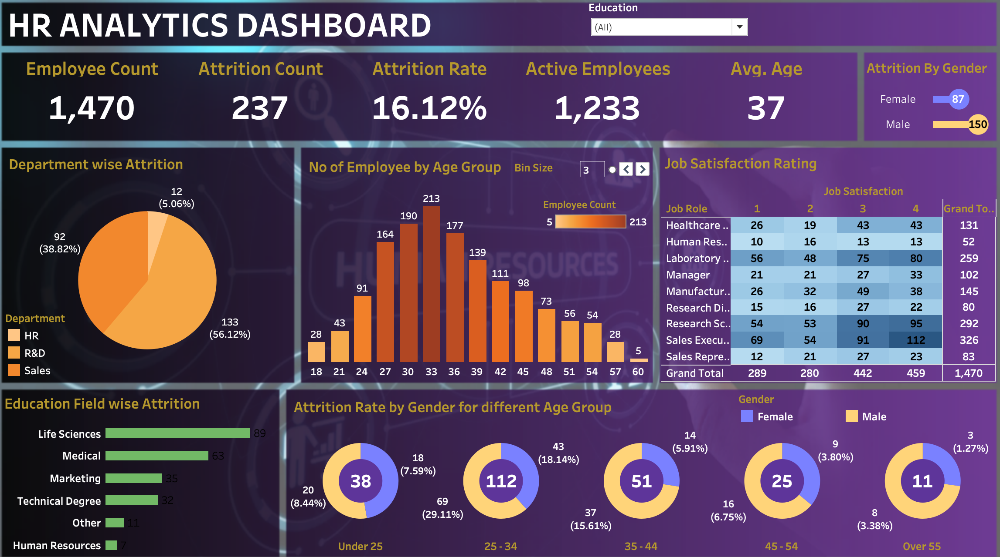

# HR Analytics Dashboard 📊

An end-to-end Tableau project that transforms raw HR data into an interactive workforce intelligence dashboard — enabling HR managers and business leaders to monitor attrition, understand workforce demographics, and make data-driven retention decisions.

🔗 **[View Live Dashboard on Tableau Public](https://public.tableau.com/app/profile/shivani.jannaikode1044/viz/HRAnalyticsDashboard_17805346818590/HRAnalyticsDashboard)**

---

## 📌 Table of Contents

- [Project Overview](#project-overview)
- [Problem Statement](#problem-statement)
- [Dashboard Preview](#dashboard-preview)
- [Key Metrics](#key-metrics)
- [Data Source](#data-source)
- [Data Preparation](#data-preparation)
- [Calculated Fields](#calculated-fields)
- [Parameters](#parameters)
- [Dashboard Visualizations](#dashboard-visualizations)
- [Dashboard Interactivity](#dashboard-interactivity)
- [Key Insights](#key-insights)
- [Skills Demonstrated](#skills-demonstrated)
- [Tools Used](#tools-used)

---

## Project Overview

Employee attrition is one of the most costly challenges organizations face. Without centralized analytics, identifying at-risk employee segments and making timely retention decisions is difficult and reactive.

This project builds a **fully interactive Tableau dashboard** that answers critical HR questions across seven visualizations — all connected through action filters so any click instantly updates the entire view.

---

## Problem Statement

HR teams often struggle to answer questions such as:

- Which departments are losing the most employees?
- Which age groups are most likely to leave?
- Does education background influence attrition?
- How satisfied are employees across different job roles?
- Are there gender-based attrition patterns?

This dashboard centralizes all of those answers in one place.

---

## Dashboard Preview



> *Screenshot of the full dashboard. Click the link above to explore the interactive version.*

---

## Key Metrics

| Metric | Value |
|---|---|
| Total Employees | 1,470 |
| Attrition Count | 237 |
| Attrition Rate | 16.12% |
| Active Employees | 1,233 |
| Average Age | 37 |

---

## Data Source

| Property | Detail |
|---|---|
| Format | Excel Flat File (.xlsx) |
| Records | 1,470 employees |
| Fields | 35+ columns |
| Domain | Human Resources |

**Field categories included:**

- **Demographics** — Age, Gender, Marital Status, Education, Education Field
- **Job Information** — Department, Job Role, Job Level, Business Travel, Over Time
- **Compensation** — Monthly Income, Daily Rate, Hourly Rate, Percent Salary Hike, Stock Option Level
- **Satisfaction** — Job Satisfaction, Environment Satisfaction, Job Involvement, Relationship Satisfaction, Work Life Balance
- **Work History** — Total Working Years, Years At Company, Years In Current Role, Years Since Last Promotion, Years With Curr Manager
- **Target Variable** — `Attrition` (Yes / No)

---

## Data Preparation

The raw Excel file was cleaned before connecting to Tableau:

- Removed duplicate rows
- Handled null/missing values across all columns
- Verified and corrected data types (numeric vs text fields)
- Standardized categorical values (Attrition: `Yes` / `No` consistently formatted)
- Removed irrelevant columns (`Over18`, `StandardHours`)
- Validated that Employee Count matched total unique records post-cleanup

---

## Calculated Fields

Three custom calculated fields were created inside Tableau to derive the core KPI metrics.

### Attrition Count

```
IF [Attrition] = "Yes" THEN 1 ELSE 0 END
```

**Purpose:** The raw `Attrition` field stores text values. This converts `"Yes"` → `1` and `"No"` → `0`, enabling Tableau to aggregate total attrition count across any dimension.

**Result:** `SUM = 237`

---

### Active Employees

```
SUM([Employee Count]) - SUM([Attrition Count])
```

**Purpose:** Derives the count of currently retained employees. Automatically adjusts when any dashboard filter is applied, giving a real-time active headcount for any selected segment.

**Result:** `1,470 − 237 = 1,233`

---

### Attrition Rate

```
SUM([Attrition Count]) / SUM([Employee Count])
```

**Purpose:** Calculates the percentage of the workforce that has left. Formatted as a percentage in Tableau. The headline KPI executives and HR managers use as the primary retention health metric.

**Result:** `237 ÷ 1,470 = 16.12%`

---

## Parameters

### Bin Size Parameter

| Property | Value |
|---|---|
| Data Type | Float |
| Minimum | 2 |
| Maximum | 10 |
| Step Size | 1 |
| Default Value | 3 |
| Controls | Age group bin width in the employee age histogram |

**How it works:** The parameter is exposed as a slider on the dashboard. Adjusting it dynamically changes how employee ages are grouped — without touching the underlying data.

| Bin Size | Age Groups Generated |
|---|---|
| 3 | 18–21, 21–24, 24–27, 27–30 ... |
| 5 | 18–23, 23–28, 28–33 ... |
| 10 | 18–28, 28–38, 38–48 ... |

---

## Dashboard Visualizations

The dashboard contains **7 worksheets**, each designed to answer one specific business question.

### 1. KPI Cards
**Business Question:** What is the overall workforce status at a glance?

A text/number view displaying the five headline metrics: Employee Count, Attrition Count, Attrition Rate, Active Employees, and Average Age. Responds to the global Education filter applied across all sheets.

---

### 2. Attrition By Gender
**Business Question:** Is attrition higher among males or females?

A horizontal bar chart with `Gender` on rows and `SUM(Attrition Count)` on columns. Male employees account for **63.3% of total attrition** (150 vs 87). Also functions as an action filter source — clicking a bar cross-filters all other charts.

---

### 3. Department-wise Attrition
**Business Question:** Which department loses the most employees?

A pie chart showing attrition proportion across the three departments:

| Department | Attrition Count | Share |
|---|---|---|
| Sales | 133 | 56.12% |
| R&D | 92 | 38.82% |
| HR | 12 | 5.06% |

---

### 4. Number of Employees by Age Group
**Business Question:** What does the workforce age profile look like?

A vertical bar chart (histogram) using `Age (bin)` on columns and `SUM(Employee Count)` on rows. Controlled by the **Bin Size parameter**. At Bin Size = 3, the 33–36 age range peaks at 213 employees, revealing a workforce concentrated in the 27–42 range.

---

### 5. Job Satisfaction Rating
**Business Question:** Which job roles have lower satisfaction scores?

A highlight table (heatmap) with `Job Satisfaction` (1–4) on columns and `Job Role` on rows. Cell color intensity represents employee count — darker = more employees at that satisfaction level.

Notable: Sales Executives peak at satisfaction level 4 with **112 employees**.

---

### 6. Education Field-wise Attrition
**Business Question:** Which educational backgrounds show higher turnover?

A horizontal bar chart showing attrition by education field:

| Education Field | Attrition Count |
|---|---|
| Life Sciences | 89 |
| Medical | 63 |
| Marketing | 35 |
| Technical Degree | 32 |
| Other | 11 |
| Human Resources | 7 |

---

### 7. Attrition Rate by Gender for Different Age Groups
**Business Question:** Which demographic segment (age + gender) is at highest attrition risk?

A row of five donut charts — one per age band — split by gender (Male / Female). The central number shows total attrition for that age group.

| Age Band | Total Attrition |
|---|---|
| Under 25 | 38 |
| 25–34 | **112** (highest) |
| 35–44 | 51 |
| 45–54 | 25 |
| Over 55 | 11 |

---

## Dashboard Interactivity

The dashboard uses **Tableau Action Filters** to create a connected, cross-filtering experience. Clicking any element in a source chart automatically filters every other visualization to match the selected dimension.

| Action | Source Chart | Filter Field | Effect |
|---|---|---|---|
| Action (Department) | Department Pie Chart | Department | All charts update to show only the selected department |
| Action (Gender) | Gender Bar Chart | Gender | All charts update to show Male or Female only |
| Action (Education Field) | Education Field Bar Chart | Education Field | All charts update to show the selected education background |

A **global Education filter** is also applied to all sheets, allowing isolation of the entire dashboard by education level: Associates, Bachelor's, Doctoral, High School, or Master's Degree.

The **Bin Size parameter control** is exposed directly on the dashboard for dynamic age histogram adjustment.

---

## Key Insights

**1. Attrition Rate of 16.12% Exceeds the Healthy Benchmark**
Industry benchmarks suggest a healthy annual attrition rate of 10–12%. At 16.12%, the organization is losing talent at an elevated rate — signaling the need for structured retention programs.

**2. Sales Has the Highest Departmental Attrition (56.12%)**
133 of 237 total departures came from Sales alone. High-pressure quotas, performance targets, and commission-dependent compensation structures may be driving burnout and turnover in this department.

**3. The 25–34 Age Band is the Highest-Risk Cohort (112 Departures)**
Nearly half of all attrition (47%) is concentrated in the 25–34 age group. This segment has enough experience to be highly marketable externally and is typically seeking faster career progression or better compensation.

**4. Life Sciences & Medical Backgrounds Account for 64% of Education-Related Attrition**
Employees from Life Sciences (89) and Medical (63) backgrounds leave at the highest rates, likely due to strong external demand from pharmaceutical, biotech, and healthcare sectors.

**5. Male Employees Constitute 63.3% of Total Attrition**
150 male vs 87 female employees departed. Role distribution, work-life balance offerings, and career growth perceptions may differ by gender — warranting a deeper segmented analysis.

---

## Skills Demonstrated

| Area | Skills |
|---|---|
| Data Preparation | Excel cleaning, null handling, data type validation, column normalization |
| Tableau Fundamentals | Excel data connection, dimension vs measure management, field type inference |
| Calculated Fields | IF/THEN/ELSE logic, SUM aggregation, derived metric creation |
| Parameters | Numeric parameter creation, bin size control, dynamic segmentation |
| Chart Design | KPI text views, horizontal bars, pie charts, histograms, heatmaps, donut charts |
| Dashboard Design | Multi-sheet assembly, layout containers, filter controls, color theming |
| Interactivity | Action filters, global filter application, parameter controls |
| Business Analysis | HR domain knowledge, translating business questions into chart specifications |
| Data Storytelling | Executive-level readability, visual hierarchy, actionable insight communication |

---

## Tools Used

- **Tableau Desktop** — Dashboard development and publishing
- **Tableau Public** — Live hosting
- **Microsoft Excel** — Data source and preparation

